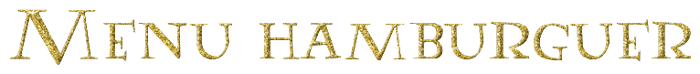
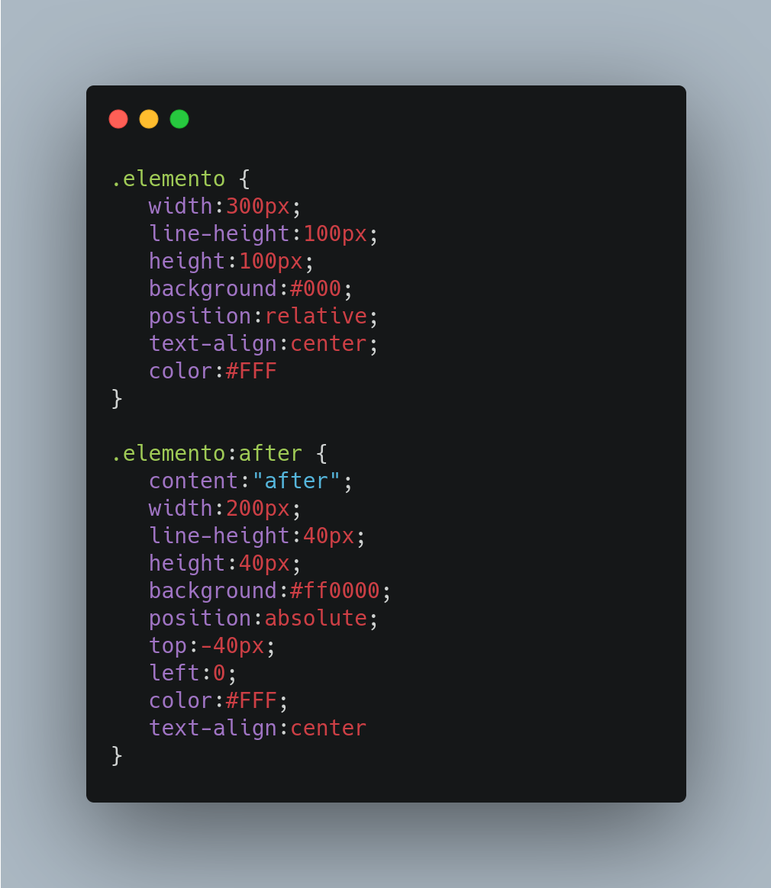
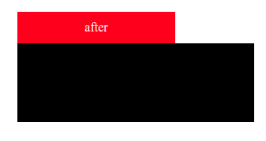

  

  
  
  

___

<h3 align="center">
  <a href="#information_source-sobre">Sobre</a>&nbsp;|&nbsp;
  <a href="#pushpin">Dica do dia!</a>&nbsp;|&nbsp;
  <a href="#rocket-tecnologias-utilizadas">Tecnologias</a>&nbsp;|&nbsp;
  <a href="#licença">Licença</a>
</h3>

___

 
 

## :information_source: Sobre

Projeto baseado no Tutorial [Criando um ícone menu hamburguer animado - CSS puro](https://youtu.be/IGz4BI-aO_8), do desenvolvedor Frontend [William Justen](https://willianjusten.com.br/cursos/).

 
 

## :pushpin: Dica do Dia!

 

### :heavy_check_mark: :after e :before

Os pseuso-elementos *:after* e *:before* são utilizados para inserir um determinado conteúdo antes ou depois de um determinado elemento, independente do elemento selecionado. 

Eles são muito úteis para a inserção de conteúdos dinâmicos no site sem a necessidade de criar elementos extras (divs, span, strong, etc) no código HTML.

O primeiro passo é selecionar a qual div o pseudo-elemento irá se relacionar e em seguida indicar para o navegador se o pseudo-elemento será inserido antes (:before) ou depois (:after) do elemento indicado.

Utiliza-se a propriedade *content* para indicar qual conteúdo dinamico que será inserido. Neste exemplo, adicionaremos uma caixa vermelha acima de uma div que já existe no conteúdo HTML do site.

  

Resultado:

  

 
 

## :rocket: Tecnologias Utilizadas 

O projeto foi desenvolvido utilizando as seguintes tecnologias

- HTML5
- CSS3
 
 

## Licença 

Esse projeto está sob a licença MIT. Veja o arquivo [LICENSE](LICENSE) para mais detalhes.

[:back:](../Readme.md)
