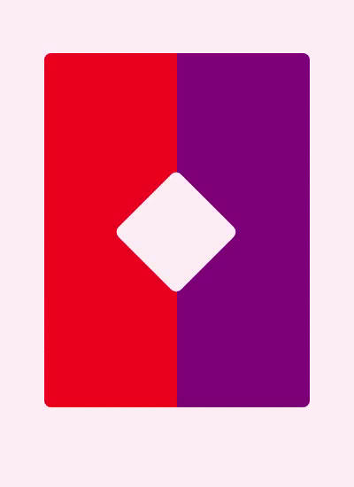
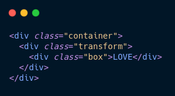
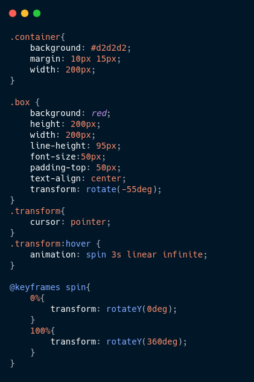
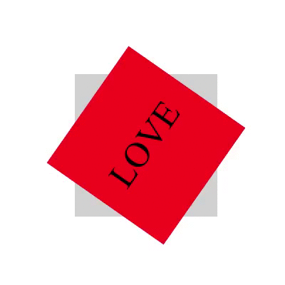
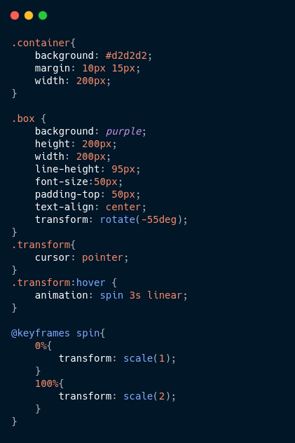
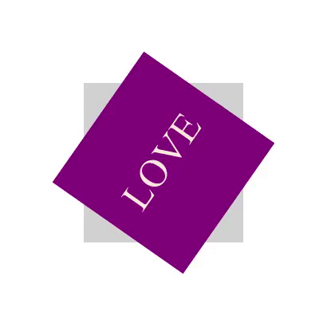
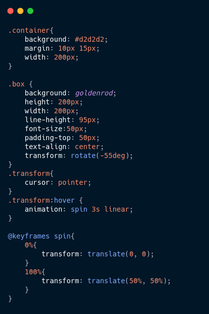
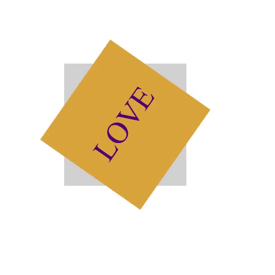
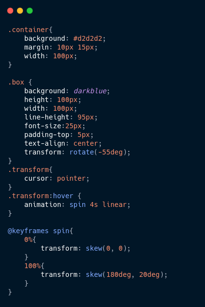

  
  

  
  
  

___

<h3 align="center">
  <a href="#information_source-sobre">Sobre</a>&nbsp;|&nbsp;
  <a href="#pushpin">Dica do dia!</a>&nbsp;|&nbsp;
  <a href="#rocket-tecnologias-utilizadas">Tecnologias</a>&nbsp;|&nbsp;
  <a href="#licença">Licença</a>
</h3>

___

 
 

## :information_source: Sobre

Projeto elaborado no estudo das propriedades do *Transform*, utilizando como referência a documentação contida na [MDN](https://developer.mozilla.org/pt-BR/docs/Web/CSS/transform) e no [W3school](https://www.w3schools.com/cssref/css3_pr_transform.asp).

 

## :pushpin: Dica do Dia!

Utilizando a propriedade transform é possível manipular visualmente um elemento: dimensionar, mover, rotacionar, etc.

Para todas as propriedades apresentadas utilizarei a mesma base no html:

  

 

### :heavy_check_mark: Rotate

É utilizada para rotacionar o elemento, de 0 a 360 graus.

Utilizando valores positivos, a rotação será realizada no sentido horário e, utilizando valores negativos, no sentido anti-horário.

  
  

 

### :heavy_check_mark: Scale

Utilizado para redimensionar os elementos, tendo como escala padrão 1. Valores maiores que 1, aumentarão o tamanho do elemento, e valores menores que 1 diminuirao sua escala.

  
  

 

### :heavy_check_mark: Translate

A função de translate serve para mover o elemento para os lados, ou para cima/baixo. 
A sintaxe pode ser especifica para um dos eixos x/y (translateX ou translateY), como pode ser apenas translate(x, y).

  
  

 

### :heavy_check_mark: Skew

É utilizado para “distorcer” os elementos, alterando os angulos.

  
  

 

## :rocket: Tecnologias Utilizadas 

O projeto foi desenvolvido utilizando as seguintes tecnologias

- HTML5
- CSS3
 
 

## Licença 

Esse projeto está sob a licença MIT. Veja o arquivo [LICENSE](LICENSE) para mais detalhes.

[:back:](../Readme.md)
